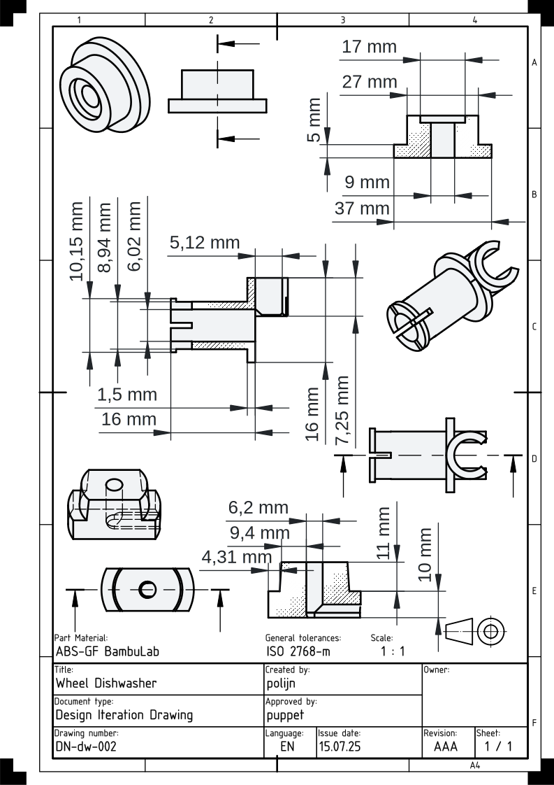

BLOG POST WORK iN PROGRESS!

## introduction
in this post, i will tell the story of how i started using OpenSCAD and now use it in combination with FreeCAD (mainly to produce nice technical drawings).

i’m not good at it at all, and i believe the way i navigate both tools could best be described as a “poor man’s method.”

it all started with a project, where i had to make 3D models for a machine i was building.
during my research i came across the OpenFlexure project and started using OpenSCAD to make the 3D models for the parts i needed.

in the last two years, i have built a lot of stuff by writing quick and dirty OpenSCAD code.
for all my models i basically use cube([x, y, z]), cylinder(r=..., h=...), translate([x, y, z]), difference(), union(), and module() to make everything.

there are some other things i’ve used, but for the first month, that was it.

one of the things i always wanted to be able to make were nice technical drawings, but i failed to make them by hand.
i found out that you can make technical drawings from 3D models with every major CAD software.
now, i use FreeCAD to make technical drawings from my OpenSCAD models.

they look like this:

